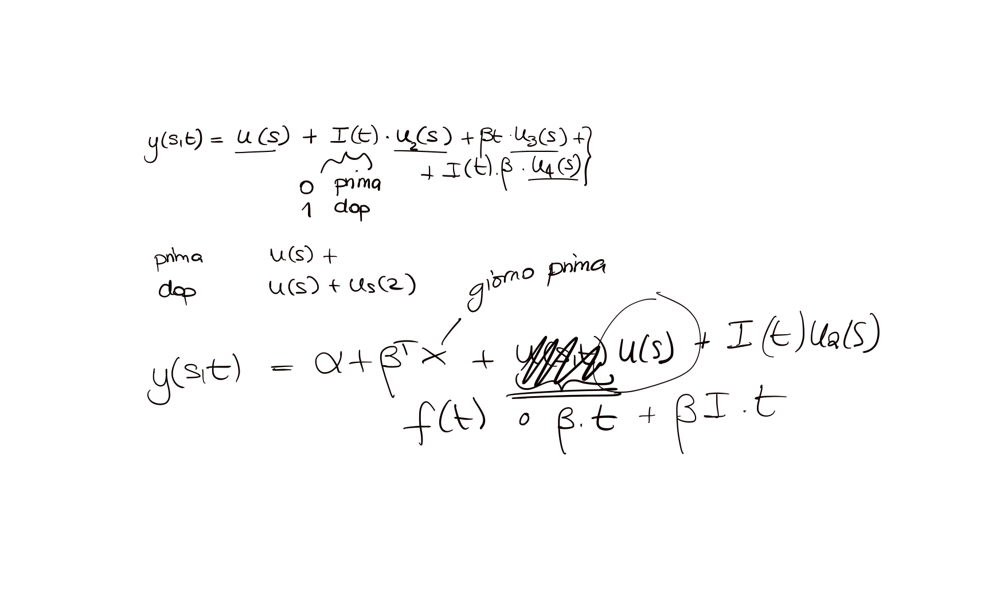

```{r,fig.width=6,include=TRUE,echo=FALSE,message=FALSE,warning=FALSE}

```

Questo modello include due componenti spde fisse: 

- una componente che rappresenta l'effetto medio spaziale

- una componente che rappresenta l'effetto medio spaziale durante il lockdown

Il trend decrescente viene rappresentato mediante una componente lineare (variabile `day`). L'obiettivo e' capire quanta della variabilita' temporale viene spiegata da `wday` (rw1) e dal valore dell'inquinante nel giorno prima.

**Al momento il modello non include l'interazione effetto lockdown/trend lineare**.


 - [Risultati generali](analisi-covariate.html)
 
 - [Residui modello](./analisi-residui-modello.html)
 
 - [Variogramma spazio-temporale](./disegnaVariogramma.html)
 
 - [spde senza lockdown](./risultati-spde.html)
 
 - [spde con lockdown](./risultati-lock_spde.html)
 
 - [serie fittate](./serieFittate.html)

