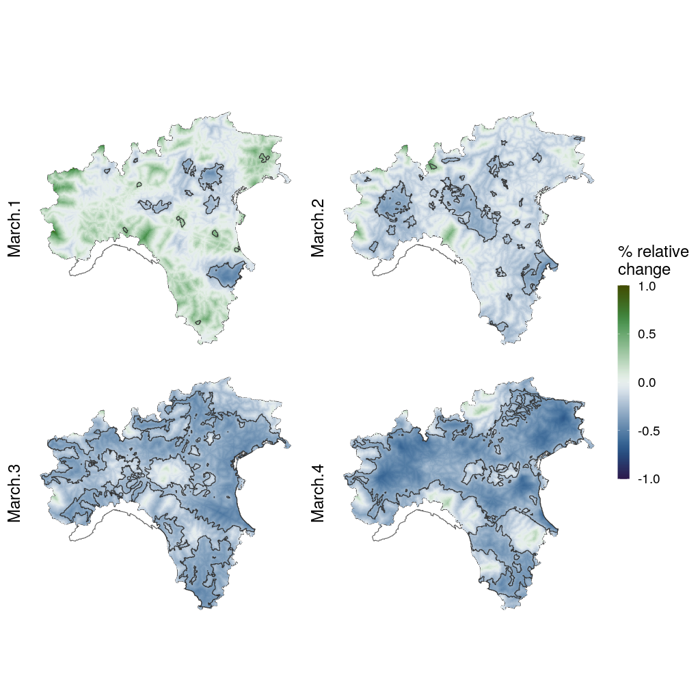

Queste mappe sono state realizzate inserendo nel modello solo le covariate significative in almeno uno dei due mesi interessati dal lockdown (marzo e aprile). 

Coviariate significative nei mesi di gennaio e febbraio non sono state inserite nel modello finale.

### Gennaio

Paletta di colori "cork"

 

### Febbraio

Paletta di colori "broc"

 

### Marzo

 

### Aprile

 